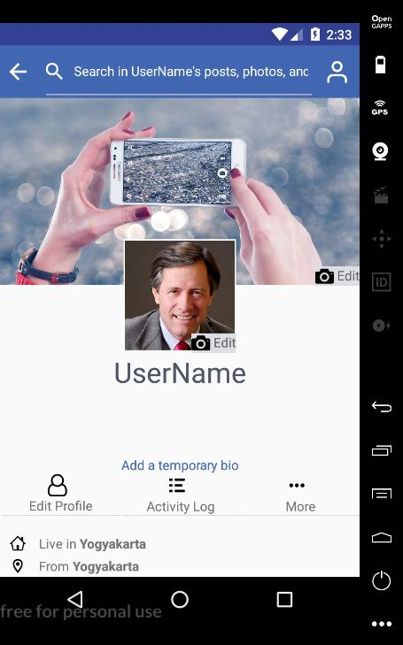
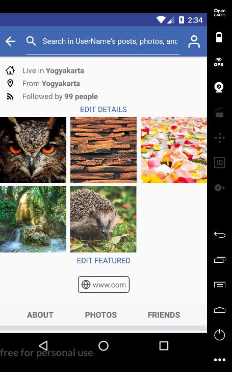
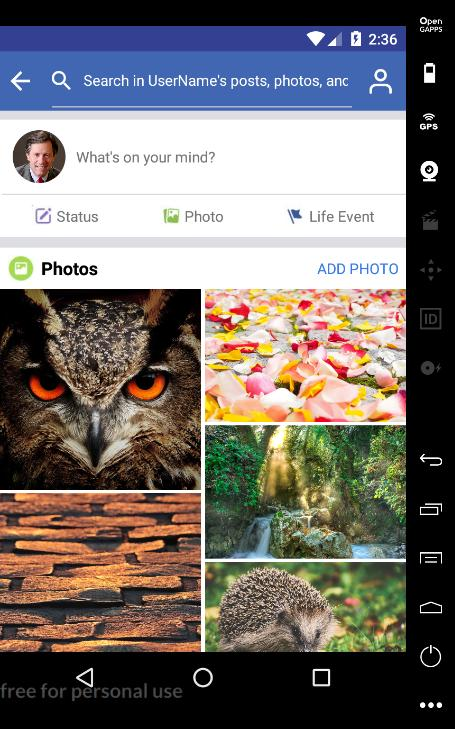
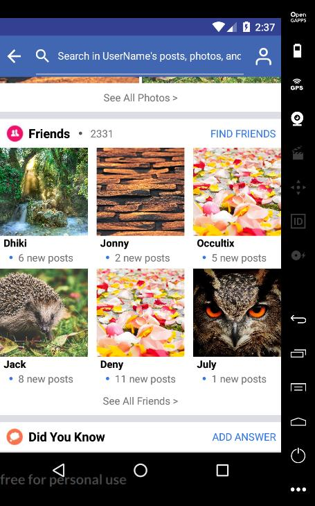
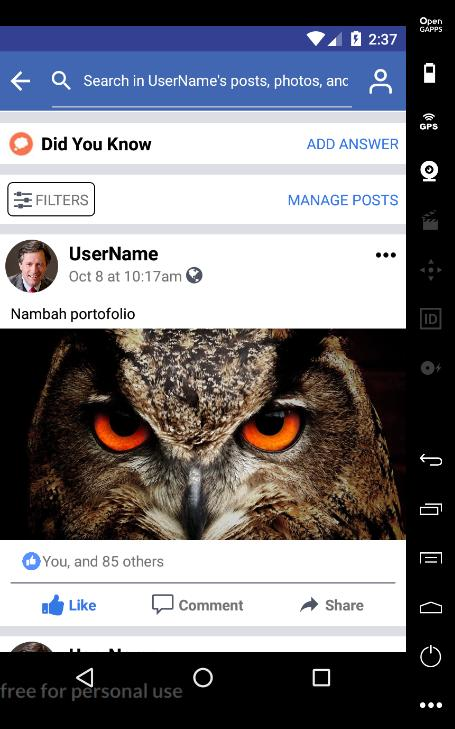

# facebookClone
Facebook profile page UI with react native.

## Installation
1. git clone https://github.com/occultix/facebookClone.git
2. cd facebookClone
3. npm install
4. react-native run-android

## Screenshot

